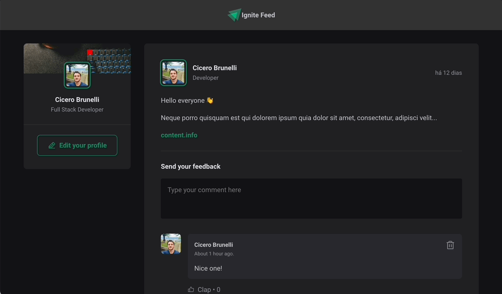

<div align="center">  
  <h1>Ignite Feed</h1>
</div>


Developed on the Ignite classes by [Rocketseat](https://rocketseat.com.br/)

## Getting Started

First, run the development server:

```bash
npm run dev
# or
yarn dev
```

Open [http://localhost:3000](http://localhost:3000) with your browser to see the result.
